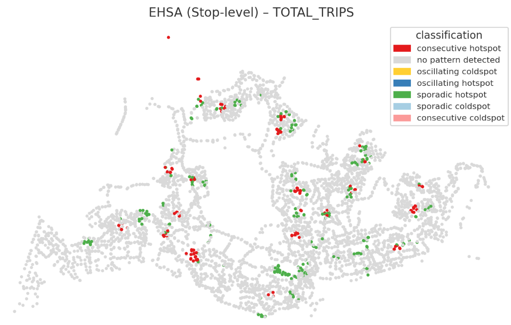

## **2.1 Introduction**

Urban mobility refers to the movement of people and goods within and between cities, spanning all modes of transport such as walking, cycling, public transit, private vehicles, and freight. Driven by factors like population growth and climate change, urban mobility planning aims to create smart, efficient, and sustainable networks that reduce congestion and emissions while enhancing quality of life and economic vitality. Key developments include the rise of shared mobility services, autonomous vehicles, and integrated smart systems that prioritize user experience, safety, and inclusivity in urban environments.

As city-wide urban infrastructures such as buses, taxis, mass rapid transit, public utilities and roads become digital, the datasets obtained can be used as a framework for tracking movement patterns through space and time. This is especially true with the widespread deployment of pervasive computing technologies such as smart cards, GPS, and RFID in vehicles. For example, routes and ridership data were collected with the use of smart cards and Global Positioning System (GPS) devices available on the public buses. These large-scale movement datasets often contain patterns that reveal important characteristics of urban mobility. Identifying and analyzing such patterns can deepen our understanding of human mobility, supporting better urban management. For both public and private transport providers, these insights enable more informed decisions and improved service planning.

In real-world practices, the use of these massive locational aware data to gain better urban mobility patterns and trends, however, tend to be confined to simple tracking and mapping with GIS applications. This is mainly because conventional GIS tools lack robust geospatial statistics capabilities for analyzing and modeling spatial and spatio-temporal data.

## **2.2 Objectives**

Local Measures of Spatial Autocorrelation (LMSA) are geospatial statisticals for identifying specific locations within a map that show significant spatial clustering of similar or dissimilar values. Unlike global measures that summarize the entire map, LMSA tests each location individually to determine whether its value, in relation to its neighbors, is more clustered or dispersed than expected by chance. This helps to find hotspots (high values clustered together), coldspots (low values clustered together), and outliers (high values surrounded by low values, or vice versa) by calculating a value for each individual location. The popular LMSA statistics include Local Moran’s I, Local Geary’s C, and the Getis-Ord Gi\*.

Emerging Hot Spot Analysis (EHSA) is a spatio-temporal technique that complements LMSA when working with spatio-temporal data. It uses a space-time cube to identify and categorize clusters of high or low values (hot and cold spots) over time. By combining local Gi\* statistics to find clusters with the Mann-Kendall test to detect trends, EHSA categorizes locations into trends such as “new,” “intensifying,” “diminishing,” or “sporadic” hot and cold spots, revealing how spatial patterns are evolving.

Both LMSA and EHSA hold tremendous potential to address complex urban mobility problems facing society. Using *Passenger Volume by Origin Destination Bus Stops* provided by [LTA DataMall](https://datamall.lta.gov.sg/content/datamall/en.html), in this exercise, you will explore two important geospatial statistical approaches for analysing urban mobility:

### **2.21 Local Measures of Spatial Autocorrelation (LMSA)**

-   Learn how to apply Local Moran’s I, Local Geary’s C, and the Getis-Ord Gi\* statistic.

-   Understand how LMSA differs from global measures by testing each location individually, revealing where values cluster together or stand apart.

-   Identify hotspots (areas of high values clustered together), cold spots (areas of low values clustered together), and spatial outliers (unusual locations where high values are surrounded by low values, or vice versa).

### **2.22 Emerging Hot Spot Analysis (EHSA)**

-   Learn how EHSA complements LMSA by adding a temporal dimension.

-   Use the space-time cube framework to track how hot and cold spots evolve over time.

-   Apply EHSA categories (e.g., “new,” “intensifying,” “diminishing,” “sporadic”) to understand whether travel patterns are strengthening, weakening, or shifting.

In conclusion, the objectives of this hands-on exercises are:

-   To discover how bus mobility patterns differ across neighborhoods, providing deeper insights than global summary measures.

-   To detect emerging patterns in urban mobility, helping planners anticipate commuting demands and design more responsive bus services and policies.

## **2.3The Task**

The specific tasks of this take-home exercise are as follows:

### **2.31 Geospatial Data Science**

-   Derive an analytical hexagon data of 375m (this distance is the perpendicular distance between the centre of the hexagon and its edges) to represent the [traffic analysis zone (TAZ)](https://tmg.utoronto.ca/files/Reports/Traffic-Zone-Guidance_March-2021_Final.pdf).

-   With reference to the time intervals provided in the table below, compute the passenger trips generated by origin at the hexagon level.

    | Peak hour period       | Bus tap on time |
    |------------------------|-----------------|
    | Weekday morning peak   | 6am to 9am      |
    | Weekday afternoon peak | 5pm to 8pm      |
    | Weekend/holiday        | 11am to 8pm     |

-   Display the geographical distribution of the passenger trips by using appropriate geovisualisation methods,

-   Describe the spatial patterns revealed by the geovisualisation (not more than 200 words per visual).

### **2.32 Local Measures of Spatial Association (LMSA) Analysis**

-   Compute LMSA statistic of the passengers trips generate by origin at hexagon level.

-   Display the LMSA maps of the passengers trips generate by origin at hexagon level. The maps should only display the significant (i.e. p-value \< 0.05)

-   With reference to the analysis results, draw statistical conclusions (not more than 200 words per visual).

### **2.33 Emerging Hot Spot Analysis(EHSA)**

With reference to the passenger trips by origin at the hexagon level for the three time intervals given above:

-   Perform Mann-Kendall Test by using the spatio-temporal local Gi\* values,

-   Prepared EHSA maps of the Gi\* values of the passenger trips by origin at the hexagon level. The maps should only display the significant (i.e. p-value \< 0.05).

-   With reference to the EHSA maps and data visualisation prepared, describe the spatial patterns reveled. (not more than 250 words per cluster).

## **2.4 The Data**

### **2.41 Apstial data**

For the purpose of this take-home exercise, the latest month *Passenger Volume by Origin Destination Bus Stops* downloaded from [LTA DataMall](https://datamall.lta.gov.sg/content/datamall/en.html) will be used.

### **2.42 Geospatial data**

Two geospatial data will be used in this study, they are:

-   *Bus Stop Location* from LTA DataMall. It provides information about all the bus stops currently being serviced by buses, including the bus stop code (identifier) and location coordinates.

-   *Master Plan 2019 Subzone Boundary (No Sea)* from [Singapore’s open data portal](https://isss626-ay2025-26aug.netlify.app/data.gov.sg).

# **2.5 Get Started**

## **2.5.1 Data Wrangling**

```{r}
pacman::p_load(sf, sfdep, tmap, 
               plotly, tidyverse, 
               Kendall,knitr)
```

```{r}
setwd("C:/Users/HT Chen/Desktop/ISSS626/ISSS626-wp/Hands-on_Ex/Hands-on_Ex01.1")
mpsz <- st_read("data/geospatial/MasterPlan2019SubzoneBoundaryNoSeaKML.kml") %>% 
  st_transform(crs = 3414)
```

```{r}
setwd("C:/Users/HT Chen/Desktop/ISSS626/ISSS626-wp/Assignment_2")
BusStop = st_read(dsn = "data/LTA_Datamall",
                  layer = "BusStop") %>% 
  st_transform(crs = 3414)
```

```{r}
setwd("C:/Users/HT Chen/Desktop/ISSS626/ISSS626-wp/Assignment_2")
odbus <- read_csv("data/origin_destination_bus_202508.csv")
```

```{r}
BusStop_in_SG <- st_join(
  BusStop, mpsz,
  join = st_within,
  left=FALSE
)
```

```{r}
tm_shape(mpsz) +
  tm_polygons() +
tm_shape(BusStop_in_SG) +
  tm_dots()
```

```{r}
#st crs is reference
#x bustop layer and y mpsz layer not the same
#coordinate conversion before join
```

```{r}
st_crs(mpsz)
```

```{r}
st_crs(BusStop)
```

## **2.5.2 Deriving Analytical Hexagon** of 375m

```{r}
#apothem = cellsize/2, 750/2 = 375m
hexagon <- st_make_grid(mpsz,
                        cellsize = 750,
                        what = "polygon",
                        square = FALSE) %>%
  st_sf()
```

```{r}
hexagon
```

```{r}
tmap_mode("plot")

tm_shape(mpsz) +
  tm_polygons(col = "lightgreen", alpha = 0.6, border.col = "white") +  
tm_shape(hexagon) +
  tm_borders(col = "gray40", lwd = 0.5) +                             
  tm_layout(
    main.title = "Analytical hexagon layer overplot on Singapore",
    main.title.size = 1.1,
    frame = TRUE,
    legend.outside = TRUE
  )
```

```{r}
hexagon$busstop_count =
  lengths(st_intersects(
    hexagon, BusStop_in_SG))

hexagon <- filter(
  hexagon, busstop_count > 0)
```

```{r}
tm_shape(mpsz) +
  tm_polygons(col = "lightgreen", alpha = 0.5, border.col = "white") +   
tm_shape(hexagon) +
  tm_borders(col = "black", lwd = 0.4) +                       
tm_shape(BusStop_in_SG) +
  tm_dots(col = "red", size = 0.02) +                      
  tm_layout(
    main.title = "Analytical hexagon layer (with bus stops) over Singapore",
    main.title.size = 1.1,
    frame = TRUE,
    legend.outside = TRUE
  )

```

```{r}
hexagon <- hexagon %>%
  select(, -busstop_count)

hexagon$HEX_ID <- sprintf(
  "H%04d", seq_len(nrow(hexagon))) %>%
  as.factor()

kable(head(hexagon))
```

```{r}
colnames(hexagon)
```

```{r}
class(mpsz)
```

```{r}
head(odbus)
```

```{r}
#hexagon$n_collisions =
#  lengths(st_intersects(
#    hexagon, BusStop_in_SG))

#hexagon <- filter(hexagon, n_collisions >0)
  
```

```{r}
colnames(odbus)
```

```{r}
trips <- odbus %>%
  select(c(YEAR_MONTH, ORIGIN_PT_CODE, DAY_TYPE, TIME_PER_HOUR, TOTAL_TRIPS)) %>%
  rename(BUS_STOP_N = ORIGIN_PT_CODE) %>%
  rename(HOUR_OF_DAY = TIME_PER_HOUR) %>%
  rename(TRIPS = TOTAL_TRIPS)
trips$BUS_STOP_N <- as.factor(trips$BUS_STOP_N)
kable(head(trips))
```

```{r}
bs_hex <- st_intersection(
  BusStop, hexagon) %>%
  st_drop_geometry() %>%
  select(c(BUS_STOP_N, HEX_ID))
kable(bs_hex)
```

```{r}
trips <- inner_join(trips, bs_hex)
kable(head(trips))
```

```{r}
trips <- trips %>%
  group_by(
    YEAR_MONTH,
    HEX_ID,
    DAY_TYPE,
    HOUR_OF_DAY) %>%
  summarise(TRIPS = sum(TRIPS))
```

```{r}
trips
```

## 2.5.3 compute the passenger trips generated by origin at the hexagon level

```{r}
trips_period <- trips %>%
  mutate(
    is_weekday = DAY_TYPE %in% c("WEEKDAY","Weekday"),
    period = case_when(
      is_weekday & dplyr::between(HOUR_OF_DAY, 6, 8)    ~ "Weekday morning peak",
      is_weekday & dplyr::between(HOUR_OF_DAY, 17, 19)  ~ "Weekday afternoon peak",
      !is_weekday & dplyr::between(HOUR_OF_DAY, 11, 19) ~ "Weekend/holiday",
      TRUE ~ NA_character_
    ),
    bus_tap_on_time = case_when(
      period == "Weekday morning peak"   ~ "6am–9am",
      period == "Weekday afternoon peak" ~ "5pm–8pm",
      period == "Weekend/holiday"        ~ "11am–8pm",
      TRUE ~ NA_character_
    )
  ) %>%
  filter(!is.na(period)) %>%
  group_by(HEX_ID, period, bus_tap_on_time) %>%
  summarise(TOTAL_TRIPS = sum(TRIPS), .groups = "drop")

```

Classify each record into one of three periods in hexagon level using Case when following the task template below,

| Peak hour period       | Bus tap on time |
|------------------------|-----------------|
| Weekday morning peak   | 6am to 9am      |
| Weekday afternoon peak | 5pm to 8pm      |
| Weekend/holiday        | 11am to 8pm     |

```{r}
#Passengers trips generate by origin at hexagon level
trips_period

```

```{r}

```

```{r}
hexagon
```

```{r}
hex_agg <- hexagon %>%
  left_join(trips_period, by = "HEX_ID")
```

```{r}
colnames(mpsz)
```

```{r}
hex_agg
```

After left join, each row now represents a hexagon(Geometry) + time window, so when you facet by `period`, each map shows spatial distribution for that specific window

```{r}
hex_agg
```

```{r}
mpsz_ok  <- st_make_valid(mpsz)
hex_ok   <- st_make_valid(hex_agg)

```

```{r}
mpsz <- mpsz %>%
  mutate(
    SUBZONE_N = str_match(Description, "SUBZONE_N</th>\\s*<td>([^<]+)")[,2],
    PLN_AREA_N = str_match(Description, "PLN_AREA_N</th>\\s*<td>([^<]+)")[,2],
    REGION_N = str_match(Description, "REGION_N</th>\\s*<td>([^<]+)")[,2]
  )
```

```{r}

mpsz_ok <- st_make_valid(mpsz)  %>% st_transform(3414)
hex_ok  <- st_make_valid(hex_agg) %>% st_transform(3414)

hex_cent <- st_centroid(hex_ok)

# tag each hex by subzone via centroid (no drops)
hex_tag  <- st_join(hex_cent, mpsz_ok["SUBZONE_N"], join = st_within, left = TRUE) %>%
  st_drop_geometry()

hex_tagged <- bind_cols(st_drop_geometry(hex_ok), hex_tag["SUBZONE_N"]) %>%
  filter(!is.na(period)) 

mpsz_trips <- hex_tagged %>%
  right_join(mpsz_ok["SUBZONE_N"], by = "SUBZONE_N") %>%   # keep all polygons
  st_as_sf()

```

```{r}
head(mpsz_trips)

```

## 2.5.4 Display the geographical distribution of the passenger trips by using appropriate geovisualisation methods

```{r}
tm_shape(mpsz)+
  tm_polygons() +
tm_shape(hex_agg) +  
  tm_dots(fill = "TOTAL_TRIPS",
          fill_alpha = 0.6,
          size = 0.5,
          fill.scale = tm_scale_intervals(
            style="quantile")) +
  tm_view(set_zoom_limits = c(11,14))
```

This map visualises how many bus trips occur within each hexagonal zone, based on aggregated counts from nearby bus stops. Darker colours represent higher passenger volumes, while lighter colours represent lower volumes.

1\. Overall Spatial Pattern

A. A Continuous High-Demand Corridor (Dark Blues)

A prominent high-density travel spine stretches across Singapore from west → central → east

This is the primary commuting corridor, home to large housing estates, employment centres, and MRT/bus interchanges.

2\. Strong Residential Heartland Trip Activity

Many hexagons surrounding large HDB towns show moderate to high trip intensity:

-   Woodlands

-   Yishun

-   Sengkang / Punggol

-   Ang Mo Kio

-   Toa Payoh

-   Bukit Panjang

-   Choa Chu Kang

This reflects the daily movement of residents travelling to work, school, and transit hubs.

3\. Major Transport Nodes = Highest Trip Concentration

The darkest hexagons (highest values, 38,497 – 415,907 trips) cluster around:

-   Jurong East Interchange

-   Woodlands Interchange

-   Bedok Interchange

-   Tampines Interchange

-   Hougang / Sengkang Interchange

-   Kallang / Paya Lebar / Geylang corridor

-   Bukit Merah / Queenstown areas

These zones are transfer hubs, explaining extremely high ridership.

Low-Demand or Unserved Areas (Light Grey)

Grey hexagons indicate missing or extremely low trip counts, typically corresponding to:

-   Industrial zones (Tuas, Jurong Island)

-   Protected natural areas (Mandai, Central Catchment)

-   Ports / restricted areas

These regions naturally have few or no bus stops.

**The Map Tells Us About Singapore’s Bus Mobility**

\(1\) Demand is not evenly distributed

Trip volumes strongly concentrate around central transport infrastructure and major residential hubs.

\(2\) The east–west urban corridor dominates

This reflects Singapore’s overall population and workplace layout.

\(3\) Bus usage supports both first–last mile and major commuter flows

High activity near MRT lines indicates heavy intermodal interchange usage.

\(4\) Polycentric clusters exist

Multiple independent activity centers — Woodlands, Tampines, Jurong East — form clear hotspots.

## Display the geographical distribution of the passenger trips aggregation by different period using Geovisualisation

```{r}
tmap_mode("plot")
options(tmap.width = 1500, tmap.height = 2000)

tm_shape(mpsz) +
  tm_polygons(col = "grey90", border.col = "white", lwd = 0.3) +       # base map layer
tm_shape(hex_agg) +
  tm_fill(
    col = "TOTAL_TRIPS",             # use the column name, not hex_agg$TOTAL_TRIPS
    style = "quantile",
    title = "Trips",
    palette = "-RdYlBu",
    legend.format = list(text.separator = "–"),
    alpha = 0.7
  ) +
  tm_borders(col = "grey40", lwd = 0.3) +
  tm_facets(by = "period", ncol = 1, free.scales = FALSE) +
  tm_layout(
    main.title = "Passenger Trips by Hexagon (Aggregated to Peak Windows)",
    legend.outside = TRUE
  )
```

## 2.5.5 Describe the spatial patterns revealed by the geovisualisation

### 2.5.5.1 **Weekday Morning Peak (6 am–9 am)**

1.High-demand zones are visible around residential areas such as Tampines, Bedok, Punggol, Woodlands, and Jurong West.

2.This reflects commuter outflow from housing estates toward employment or education centres.

3.Central hexagons also show high trip counts, indicating incoming trips to CBD or business areas (e.g., Raffles Place, Orchard, Novena).

### **2.5.5.2 Weekday Afternoon Peak (5 pm–8 pm)**

1.Hotspots roughly mirror the morning pattern but show a reverse commuting direction — reflecting return trips from workplaces back to residential neighbourhoods.

2.Central business districts (CBD, Orchard, and Bukit Merah) remain prominent, consistent with strong evening travel activity.

3.Slightly higher activity near suburban malls and interchanges (e.g., Tampines, Clementi, Jurong East) suggests after-work travel and shopping trips.

### **2.5.5.3 Weekend/Holiday Period (11 am–8 pm)**

1.The pattern becomes more spatially dispersed, with moderate-to-high activity extending into recreational zones — East Coast Park, Sentosa, Jurong Lake, and Orchard shopping belt.

2.Central and eastern residential areas still register strong demand, but the overall intensity is lower than weekday peaks.

3.This indicates non-work-related mobility, such as leisure, family, and retail trips, dominating the weekend pattern.

The map reveals:

\(1\) Singapore’s core mobility spine

A central high-demand band runs from Jurong East → Buona Vista → Queenstown → Bukit Merah → Kallang → Geylang → Tampines.

\(2\) Residential → Employment Flow

Morning peaks show strong activity from suburbs to city, reflecting typical daily commuting.

\(3\) Leisure Shift on Weekends

Weekend patterns move towards city malls, waterfronts, and recreation nodes.

\(4\) Transport Interchanges = Trip Magnets

Almost all major interchanges appear as dark hotspots across all periods.

\(5\) Spatial consistency

Many high-flow hexagons remain consistent across all times — these are Singapore’s permanent “mobility anchors”.\

# 2.6 **Local Measures of Spatial Association (LMSA) Analysis**

## 2.6.1 Compute LMSA statistic of the passengers trips generate by origin at hexagon level

### 2.6.1.1 Local Moran's I Statistic

```{r}
set.seed(1234)
```

```{r}
colnames(mpsz_trips)
```

```{r}
hex_agg
```

```{r}
any(is.na(hex_agg))
```

```{r}
sum(is.na(hex_agg))

```

```{r}
colSums(is.na(hex_agg))
```

```{r}
#hex_agg_clean <- hex_agg %>%
#  filter(!is.na(TOTAL_TRIPS))

```

```{r}
hex_agg_clean <- hex_agg %>% 
  drop_na()
```

```{r}
mpsz_trips_clean <- mpsz_trips %>% 
  drop_na()
```

```{r}
colSums(is.na(hex_agg_clean))
```

```{r}
hex_agg_clean
```

```         
```

```{r}
nb <- st_contiguity(mpsz_trips_clean)
wt <- st_weights(nb,style = "W")
```

```{r}

lisa <- mpsz_trips_clean %>% 
  mutate(local_moran = local_moran(
    TOTAL_TRIPS, 
    nb,
    wt, 
    nsim = 99),
         .before = 1) %>%
  unnest(local_moran)

```

```{r}
tm_shape(lisa) +
  tm_polygons(fill = "ii",
              fill.scale = tm_scale_intervals(
                style = "pretty",
                n = 5,
                values = "brewer.RdBu"),
              fill.legend = tm_legend(
                title = "Local Morans'I",
                position = tm_pos_out())) + 
  tm_borders(fill_alpha = 0.5) +
  tm_title("Loal Morans'I of TOTAL_TRIPS (Queen's method)")
```

local version of Moran’s I, showing where clustering occurs instead of giving one single global number.

Queen’s contiguity rule, so neighbors share either a border or a corner.

-   Blue clusters → Areas where passenger trips are spatially clustered (e.g., CBD, Tampines, Punggol, Jurong West).

-   These indicate consistent travel intensity across neighboring subzones. Example: High Moran’s I in central or northeast Singapore → dense bus ridership areas.

-   Orange polygons → Spatial outliers (values very different from neighbors). Example: Industrial or coastal subzones (e.g., Tuas, Changi) — low trips surrounded by higher ones.

-   Pale neutral areas (0–2) → Random or weak correlation; no clear spatial pattern

```{r}
tm_shape(lisa) +
  tm_polygons(fill = "p_ii", 
              fill.scale = tm_scale_intervals(
                breaks = c(-Inf, 0.001, 0.01, 0.05, 0.1, Inf),
                values = "-brewer.Reds"),
              fill.legend = tm_legend(
                title = "p-value",
      position = tm_pos_out())) + 
  tm_borders(fill_alpha = 0.5) +
  tm_title("p-values of Loal Moran's I of TOTAL_TRIPS (Queen's method)")
```

-   Dark red regions — These subzones show very strong evidence (p \< 0.001 or 0.01) of spatial clustering of similar trip values.\
    → These are statistically significant hot/cold clusters.\
    For example, central Singapore (CBD, Toa Payoh, Bukit Merah) or dense residential zones (Tampines, Punggol) may appear dark red.
-   Medium/light red (0.01–0.05) — These are moderate-confidence clusters — still likely to be meaningful, but not as robust.
-   Yellowish or pale areas (\>0.05) — These subzones do not exhibit significant local spatial correlation.\
    → Trip patterns there may fluctuate randomly (e.g., low-demand or fringe industrial areas such as Tuas or Changi).
-   Spatial distribution pattern — The presence of large red patches across the city suggests that trip volumes are not randomly distributed, but rather spatially structured, with clear regional clustering (high ridership in the east/central, lower in west/industrial zones).

```{r}
ii.map <- tm_shape(lisa) +
  tm_polygons(fill = "ii",
              fill.scale = tm_scale_intervals(
                style = "pretty",
                n = 5,
                values = "brewer.RdBu"),
              fill.legend = tm_legend(
                title = "Local Moran's I",
                position = tm_pos_in(
                  "left", "bottom"))) + 
  tm_borders(fill_alpha = 0.5) +
  tm_title("Loal Moran's I of TOTAL_TRIPS (Queen's method)")

p_ii.map <- tm_shape(lisa) +
  tm_polygons(fill = "p_ii", 
              fill.scale = tm_scale_intervals(
                breaks = c(-Inf, 0.001, 0.01, 0.05, 0.1, Inf),
                values = "-brewer.Reds"),
              fill.legend = tm_legend(
                title = "p-value",
      position = tm_pos_in("left", "bottom")
    )) + 
  tm_borders(fill_alpha = 0.5) +
  tm_title("p-values of Loal Moran's I of TOTAL_TRIPS (Queen's method)")

tmap_arrange(ii.map, p_ii.map, asp=1, ncol=2)
```

```{r}
lisa <- lisa %>%
  mutate(lag_TOTAL_TRIPS = st_lag(
    TOTAL_TRIPS, nb, wt),
    .before = 1) %>%
  unnest(lag_TOTAL_TRIPS)
```

```{r}
ggplot(data = lisa, 
       aes(x = TOTAL_TRIPS, 
           y = lag_TOTAL_TRIPS, 
           color = mean)) +
  geom_point(size = 2) +
  geom_smooth(method = "lm", 
              se = FALSE, 
              color = "black") +
  geom_hline(yintercept=mean(lisa$lag_TOTAL_TRIPS), lty=2) + 
    geom_vline(xintercept=mean(lisa$TOTAL_TRIPS), lty=2) +
  scale_color_manual(
    values = c("High-High" = "red", 
               "Low-Low" = "blue",
               "Low-High" = "lightblue", 
               "High-Low" = "pink")) +
  labs(x = "TOTAL_TRIPS",
       y = "Spatial Lag of TOTAL_TRIPS",
       title = "Moran Scatterplot with LISA Quadrants") +
  theme_minimal()
```

**High–High (Hot Spot)**

Areas with high TOTAL_TRIPS surrounded by high-trip neighbors.\
➡ Indicates clusters of strong bus activity — major transport hubs or dense urban areas with consistent high demand.

**Low–High (Low Surrounded by High): Outlier**

Areas with low TOTAL_TRIPS surrounded by high-trip neighbors.\
➡ Represents anomalous low-demand pockets within high-demand zones — possibly parks, non-residential land, or zones with limited bus access.

**Low–Low (Cold Spot)**

Areas with low TOTAL_TRIPS surrounded by low-trip neighbors.\
➡ Shows clusters of consistently low activity, often in suburban, industrial, or low-density regions with weaker public transport use.

**High–Low (High Surrounded by Low): Outlier**

Areas with high TOTAL_TRIPS surrounded by low-trip neighbors.\
➡ Reflects isolated hotspots — stand-alone transport nodes or interchange points in otherwise low-demand surroundings.

```{r}
lisa <- lisa %>%
  mutate(
    LISA_cluster = ifelse(
      p_ii < 0.05,
      as.character(mean), 
      "Insignificant"),
    LISA_cluster = factor(
      LISA_cluster,
      levels = c("Insignificant", "Low-Low", "Low-High", "High-Low", "High-High")
    )
  )
```

```{r}
lisa_map <- tm_shape(lisa) + 
  tm_polygons(
    fill = "LISA_cluster",
    fill.scale = tm_scale_categorical(
      values = c(
        "grey80",      # Insignificant
        "blue",        # Low-Low
        "lightblue",   # Low-High
        "pink",        # High-Low
        "red"          # High-High
      )
    ),
    fill.legend = tm_legend(
      title = "LISA Cluster",
      position = tm_pos_in("left", "bottom"))
  ) +
  tm_borders() +
  tm_title("Local Moran's I Clusters (p < 0.05)")
lisa_map
```

1.  **Red Hot Spots (High–High)**

    Concentrated in high-demand subzones (likely Central, Orchard, Toa Payoh, Tampines, Hougang).

    These are key trip-generating regions, where travel intensity is spatially consistent.

    Reflects major residential/commercial nodes with dense transport demand.

2.  **Blue Cold Spots (Low–Low)**

    Found in western (Tuas), northeast coastal, and rural/industrial regions.

    Represents low ridership clusters, possibly due to low population density or limited service coverage.

3.  **Pink (High–Low Outliers)**

    High-trip subzones embedded within low-trip surroundings — e.g., transport interchanges, business parks, or education hubs (e.g., NUS, Changi Business Park).

    These are local anomalies — important for targeted service planning.

4.  **Light Blue (Low–High Outliers)**

    Low-trip subzones surrounded by high-trip neighbors — potential underserved areas.

    Could indicate inefficient routes or limited connectivity relative to surrounding high-demand zones.

5.  **Grey Areas (Insignificant)**

    No meaningful spatial pattern detected — trip counts vary randomly or lack consistent neighborhood structure.

```{r}
mpsz_trips_clean
```

### 2.6.1.3 Getis-Ord Gi\* Statistic

```{r}
nb <- st_contiguity(hex_agg_clean)
wt <- st_weights(nb,style = "W")
```

```{r}
ct <- critical_threshold(st_geometry(hex_agg_clean))
ct
```

```{r}
hex_agg
```

```{r}
mpsz_trips_clean
```

The summary report shows that the largest first nearest neighbour distance is 750m

```{r}
hex_agg_clean_fdw <- hex_agg_clean %>% 
  mutate(nb = include_self(
    st_dist_band(
      st_geometry(geometry), 
                 upper = ct)),
    wt = st_weights(nb, 
                      style = "W"),
    .before = 1) 
```

```{r}
hex_agg_clean_adw <- hex_agg_clean %>%
  mutate(nb = include_self(
    st_knn(
      st_geometry(geometry),
      k = 6)),
    wt = st_weights(
      nb, style = "W"),
    .before = 1)
```

```{r}
HCSA_fdw <- hex_agg_clean_fdw %>%
  mutate(
    gistar = local_gstar_perm(
      TOTAL_TRIPS, nb, wt, nsim = 99),
    .before = 1) %>%
  unnest(gistar)
```

```{r}
tm_shape(mpsz)+
  tm_polygons() +
tm_shape(HCSA_fdw) +
  tm_polygons(fill = "gi_star",
              fill.scale = tm_scale_intervals(
                style = "pretty",
                n = 6,
                values = "brewer.rd_bu"),
              fill.legend = tm_legend(
                title = "Gi*",
                position = tm_pos_out())) + 
  tm_borders(fill_alpha = 0.5) +
  tm_title("Gi* of TOTAL_TRIPS (Fixed Bandwidth d = 750m)")
```

The Getis-Ord Gi\* statistic identifies local spatial clusters of high or low values by comparing each hexagon’s value to its neighbors.

-   High Gi\* (positive, dark blue):\
    The hexagon and its neighbors all have high TOTAL_TRIPS → a hot spot.

-   Low Gi\* (negative, orange/red):\
    The hexagon and its neighbors all have low TOTAL_TRIPS → a cold spot.

-   Near 0 Gi\* (light colors):\
    No significant clustering → values are spatially random or transitional.

```{r}
tm_shape(mpsz)+
  tm_polygons() +
tm_shape(HCSA_fdw) +
  tm_polygons(fill = "p_sim", 
              fill.scale = tm_scale_intervals(
                breaks = c(-Inf, 0.001, 0.01, 0.05, 0.1, Inf),
                values = "-brewer.Reds"),
              fill.legend = tm_legend(
                title = "simulated p-value",
      position = tm_pos_out())) + 
  tm_borders(fill_alpha = 0.5) +
  tm_title("p-values of local Gi* of TOTAL_TRIPS (Fixed distance)")
```

-   **Strong red clusters** appear mainly in the north, west, and east parts of Singapore — corresponding to areas with known hot or cold Gi\* values in your previous map.\
    These zones represent statistically significant clusters of either high (hot) or low (cold) TOTAL_TRIPS.

-   **Central areas** (greyish or light pink) have higher p-values (\> 0.05) → their clustering is not statistically significant — meaning bus trip density there is more mixed or random.

```{r}
Gi_star_map <- tm_shape(mpsz)+
  tm_polygons() + tm_shape(HCSA_fdw) +
  tm_polygons(fill = "gi_star",
              fill.scale = tm_scale_intervals(
                style = "pretty",
                n = 5,
                values = "-brewer.rd_bu"),
              fill.legend = tm_legend(
                title = "local Gi*",
                position = tm_pos_in(
                  "left", "bottom"))) + 
  tm_borders(fill_alpha = 0.5) +
  tm_title("Local Gi* of TOTAL_TRIPS")

p_values_map <- tm_shape(mpsz)+
  tm_polygons() + tm_shape(HCSA_fdw) +
  tm_polygons(fill = "p_sim", 
              fill.scale = tm_scale_intervals(
                breaks = c(0, 0.001, 0.01, 0.05, 0.1, 1),
                values = "-brewer.reds"),
              fill.legend = tm_legend(
                title = "p-value",
      position = tm_pos_in("left", "bottom")
    )) + 
  tm_borders(fill_alpha = 0.5) +
  tm_title("p-values of local Gi* of TOTAL_TRIPS (fixed distance)")

tmap_arrange(Gi_star_map, p_values_map, asp=1, ncol=2)
```

```{r}
HCSA_fdw <- HCSA_fdw %>%
  mutate(HCSA_cluster = case_when(
    p_sim > 0.05 ~ "Insignificant",
    p_sim <= 0.05 & cluster == "High" ~ "Hot spot",
    p_sim <= 0.05 & cluster == "Low"  ~ "Cold spot",
    TRUE ~ "Other"),
    HCSA_cluster = factor(
      HCSA_cluster,
      levels = c("Insignificant", "Hot spot", "Cold spot")
    ),
    .before = 1
  )
```

```{r}
HCSA_map <- tm_shape(mpsz)+
  tm_polygons() + tm_shape(HCSA_fdw) + 
  tm_polygons(
    fill = "HCSA_cluster",
    fill.scale = tm_scale_categorical(
      values = c(
        "grey80",      # Insignificant
        "red",        # Low-Low
        "blue"          # High-High
      )
    ),
    fill.legend = tm_legend(
      title = "HSCA Cluster",
      position = tm_pos_in("left", "bottom"))
  ) +
  tm_borders() +
  tm_title("HCSA Clusters (p < 0.05)")
HCSA_map
```

-   Red (Hot Spot) → “High-High” cluster: areas where high TOTAL_TRIPS values are surrounded by other high values.

-   Blue (Cold Spot) → “Low-Low” cluster: areas where low TOTAL_TRIPS values are surrounded by low values.

-   Grey (Insignificant) → not statistically significant; no clear spatial pattern (random variation).

```{r}
tmap_arrange(Gi_star_map, HCSA_map, asp=1, ncol=2)
```

# **2.7 Emerging Hot Spot Analysis(EHSA)**

## 2.7.1 Creating Space Time Cube

```{r}
trips_period_1 <- trips %>%
  mutate(
    is_weekday = DAY_TYPE %in% c("WEEKDAY", "Weekday"),
    period = case_when(
      is_weekday & dplyr::between(HOUR_OF_DAY, 6, 8) ~ "Weekday morning peak",
      is_weekday & dplyr::between(HOUR_OF_DAY, 17, 19) ~ "Weekday afternoon peak",
      !is_weekday & dplyr::between(HOUR_OF_DAY, 11, 19) ~ "Weekend/holiday",
      TRUE ~ NA_character_
    ),
    bus_tap_on_time = case_when(
      period == "Weekday morning peak" ~ "6am–9am",
      period == "Weekday afternoon peak" ~ "5pm–8pm",
      period == "Weekend/holiday" ~ "11am–8pm",
      TRUE ~ NA_character_
    )
  ) %>%
  filter(!is.na(period)) %>%
  group_by(HEX_ID, period, bus_tap_on_time, HOUR_OF_DAY) %>%   # <- HOUR_OF_DAY included here
  summarise(TOTAL_TRIPS = sum(TRIPS), .groups = "drop")


```

```{r}
head(trips_period_1)
```

```{r}
hex_agg_1 <- hexagon %>%
  left_join(trips_period_1, by = "HEX_ID")
```

```{r}
hex_agg_1
```

```{r}
hex_agg_2 <- hex_agg_1 %>%
  mutate(
    time_id = factor(
      HOUR_OF_DAY,
      levels = sort(unique(HOUR_OF_DAY)),
      ordered = TRUE
    )
  )

hex_attr <- hex_agg_2 %>%
  st_drop_geometry() %>%
  tidyr::complete(HEX_ID, time_id, fill = list(TOTAL_TRIPS = 0))

hex_geom <- hex_agg_2 %>%
  select(HEX_ID, geometry) %>%
  distinct(HEX_ID, .keep_all = TRUE)

```

```{r}
hex_attr_clean <- hex_agg_2 %>%
  st_drop_geometry() %>%
  filter(!is.na(HEX_ID), !is.na(time_id)) %>%        
  distinct(HEX_ID, time_id, .keep_all = TRUE) %>%   
  tidyr::complete(
    HEX_ID, time_id, 
    fill = list(TOTAL_TRIPS = 0)
  )
```

```{r}
hex_geom_clean <- hex_agg_2 %>%
  select(HEX_ID, geometry) %>%
  filter(!is.na(HEX_ID)) %>%           
  filter(!st_is_empty(geometry)) %>%   
  distinct(HEX_ID, .keep_all = TRUE)   
```

```{r}
hex_geom_clean
```

```{r}
hex_attr_clean_1 <- hex_attr_clean %>% group_by(HOUR_OF_DAY)
```

```{r}
hex_attr_clean_1
```

```{r}
trips_st_1 <- spacetime(
  hex_attr_clean,
  hex_geom_clean,
  .loc_col  = "HEX_ID",
  .time_col = "time_id"
)

```

```{r}
is_spacetime_cube(trips_st_1)
```

```{r}
head(trips_st_1)
```

```{r}
hex_geom
```

## 2.7.2 Computing Gi\*

```{r}
trips_nb <- trips_st_1 %>%
  activate("geometry") %>%
  mutate(nb = include_self(
    st_contiguity(geometry)),
    wt = st_inverse_distance(nb, 
                             geometry, 
                             scale = 1,
                             alpha = 1),
    .before = 1) %>%
  set_nbs("nb") %>%
  set_wts("wt")
```

```{r}
missing_hex <- mpsz_trips_clean %>%
  st_drop_geometry() %>%
  group_by(HEX_ID) %>%
  summarise(n_periods = n_distinct(bus_tap_on_time)) %>%
  filter(n_periods < length(levels(mpsz_trips_clean$bus_tap_on_time)))

missing_hex
```

No missing hex id

```{r}
mpsz_trips_clean_filtered <- mpsz_trips_clean %>%
  filter(!HEX_ID %in% missing_hex$HEX_ID)

```

The dataset doesn’t have a record for every combination of\
`HEX_ID × bus_tap_on_time`.

For a valid space–time cube, each hexagon must appear once for each time slice (e.g., 3 periods × all hexagons).

```{r}
# check which HEX_ID are missing time periods
mpsz_trips_clean %>%
  group_by(HEX_ID) %>%
  summarise(unique_periods = n_distinct(bus_tap_on_time)) %>%
  filter(unique_periods < 3)

```

```{r}

```

```{r}
mpsz_trips_complete <- mpsz_trips_clean_filtered %>%
  tidyr::expand(HEX_ID, bus_tap_on_time) %>%     
  left_join(mpsz_trips_clean, by = c("HEX_ID", "bus_tap_on_time")) %>%
  mutate(TOTAL_TRIPS = replace_na(TOTAL_TRIPS, 0)) %>%
  left_join(st_drop_geometry(hexagon), by = "HEX_ID") %>%
  st_as_sf(crs = st_crs(hexagon))
```

```{r}
class(mpsz_trips_complete)
```

```{r}

head(mpsz_trips_complete)
```

```{r}

mpsz_trips_complete <- mpsz_trips_complete %>%
  mutate(
    bus_tap_on_time = factor(
      bus_tap_on_time,
      levels = c("6am–9am", "5pm–8pm", "11am–8pm"),
      ordered = TRUE
    )
  )


trips_st <- spacetime(
  mpsz_trips_complete,   # data with time variable
  hexagon,            # geometry sf object
  .loc_col = "HEX_ID",
  .time_col = "bus_tap_on_time"
)

```

```{r}
is_spacetime_cube(trips_st)
```

```{r}
class(mpsz_trips_complete)
```

## 2.7.2 Computing Gi\*

```{r}
trips_nb <- trips_st %>%
  activate("geometry") %>%
  mutate(nb = include_self(
    st_contiguity(geometry)),
    wt = st_inverse_distance(nb, 
                             geometry, 
                             scale = 1,
                             alpha = 1),
    .before = 1) %>%
  set_nbs("nb") %>%
  set_wts("wt")
```

```{r}
gi_stars <- trips_nb %>% 
  group_by(bus_tap_on_time) %>% 
  mutate(gi_star = local_gstar_perm(
    TOTAL_TRIPS, nb, wt)) %>% 
  tidyr::unnest(gi_star)
```

## 2.7.3 **Mann-Kendall Test**

A **monotonic series** or function is one that only increases (or decreases) and never changes direction. So long as the function either stays flat or continues to increase, it is monotonic.

H0: No monotonic trend

H1: Monotonic trend is present

**Interpretation**

-   Reject the null-hypothesis null if the p-value is smaller than the alpha value (i.e. 1-confident level)

-   Tau ranges between -1 and 1 where:

    -   -1 is a perfectly decreasing series, and

    -   1 is a perfectly increasing series.

```{r}
cbg1 <- gi_stars %>%
  ungroup() %>%
  filter(HEX_ID == "H0001") %>%   # choose one spatial unit
  select(HEX_ID, bus_tap_on_time, gi_star)
```

```{r}
ggplot(data = cbg1,
       aes(x = bus_tap_on_time, y = gi_star, group = 1)) +
  geom_line(color = "steelblue", linewidth = 1) +
  geom_point(size = 2, color = "darkred") +
  labs(
    title = "Gi* Trend Across Time Periods for HEX_ID H0001",
    x = "Time Period",
    y = "Gi* Statistic"
  ) +
  theme_light()

```

```{r}
cbg <- gi_stars %>%
  ungroup() %>%
  select(HEX_ID, bus_tap_on_time, gi_star)

```

```{r}
ggplot(data = cbg,
       aes(x = HEX_ID, y = gi_star, group = 1)) +
  geom_line(color = "steelblue", linewidth = 1) +
  geom_point(size = 2, color = "darkred") +
  facet_wrap(~ bus_tap_on_time, ncol = 1, scales = "free_y") +
  labs(
    title = "Gi* Hotspot Trends Across Time Slices",
    x = "Hexagon ID",
    y = "Gi* Statistic"
  ) +
  theme_light() +
  theme(
    strip.text = element_text(size = 12, face = "bold"),
    axis.text.x = element_text(angle = 90, hjust = 1)
  )

```

We can see above which HEX ID (Bus stop_location) from 3 different periods separately

```{r}
cbg %>%
  summarise(mk = list(
    unclass(
      Kendall::MannKendall(gi_star)))) %>% 
  tidyr::unnest_wider(mk)
```

```{r}
ehsa <- gi_stars %>%
  group_by(HEX_ID) %>%
  summarise(mk = list(
    unclass(
      Kendall::MannKendall(gi_star)))) %>%
  tidyr::unnest_wider(mk)
head(ehsa)
```

```{r}
emerging <- ehsa %>% 
  arrange(sl, abs(tau)) %>% 
  slice(1:10)
head(emerging)
```

`tau = 0.333333`

This means there is a **weak positive monotonic trend** in Gi\* across your time slices.

In your context → the **hotspot intensity (Gi\*) is slightly increasing** for these hexagons over time (morning → afternoon → weekend).

🔹 `sl = 1`

The **p-value = 1** means this trend is **not statistically significant**.

So even though there’s a small positive direction, it’s **not strong enough to be considered a meaningful temporal change**.

In other words:

> For H0001–H0006, Gi\* values increased slightly over time,\
> but the change is statistically insignificant — the trend could easily occur by chance

```{r}


```

```{r}

```

```{r}

```

```{r}


```

```{r}

```

```{r}

```

```{r}


```

## **2.7.5 Visualising EHSA**

```{r}
ehsa <- emerging_hotspot_analysis(
  x = trips_st,          # your spacetime cube
  .var = "TOTAL_TRIPS",  # variable to analyse hotspots
  k = 1,                 # one-time lag (default)
  nsim = 99              # number of permutations
)

```

```{r}
#ehsa_sig <- ehsa  %>%
#  filter(p_value < 0.05)
#tmap_mode("plot")
#tm_shape(hunan_ehsa) +
#  tm_polygons() +
#  tm_borders(fill_alpha = 0.5) +
#tm_shape(ehsa_sig) +
#  tm_fill("classification") + 
#  tm_borders(fill_alpha = 0.4)
```



EHSA Analysis:

The EHSA map reveals spatial–temporal patterns of bus stop usage across Singapore. Each bus stop is classified into hotspot types (e.g., consecutive, sporadic, oscillating) based on Total Trip volumes across three time slices:\
Morning Peak (6–9 am), Evening Peak (5–8 pm), and Weekend/Holiday (11 am–8 pm).

Key Hotspot Observations

Consecutive Hotspots are concentrated in downtown and transport hubs such as Marina Bay, Orchard, Tampines, Jurong East, and Woodlands Interchange, indicating persistently high ridership across all time periods.

Sporadic Hotspots appear near neighbourhood commercial centres (e.g., Hougang, Punggol, Clementi), where passenger volumes spike only during specific periods—typically evening or weekends.

Oscillating Hotspots are found in mixed-use districts (e.g., Buona Vista, One-North) that show alternating patterns between high and moderate activity.

Cold Spot Trends

Consecutive Coldspots occur mainly in low-density residential or industrial areas, such as Tuas, Seletar West, and Lim Chu Kang, suggesting consistently low trip counts.

Sporadic Coldspots near urban fringes indicate time-dependent inactivity, possibly linked to limited service frequency or workday-only commuting patterns.

Interpretation

The spatial clustering of hotspots mirrors Singapore’s polycentric urban structure—major employment and interchange nodes sustain consistent demand, while suburban and industrial zones show periodic variation. This pattern suggests a mature, hub-and-spoke ridership model shaped by work–home flows and weekend leisure travel.

Policy & Planning Insights

Sustained hotspots warrant continued capacity support and crowd management measures.

Sporadic or oscillating zones could benefit from dynamic scheduling or demand-responsive routing.

Persistent coldspots may signal over-servicing or potential areas for route optimization.
